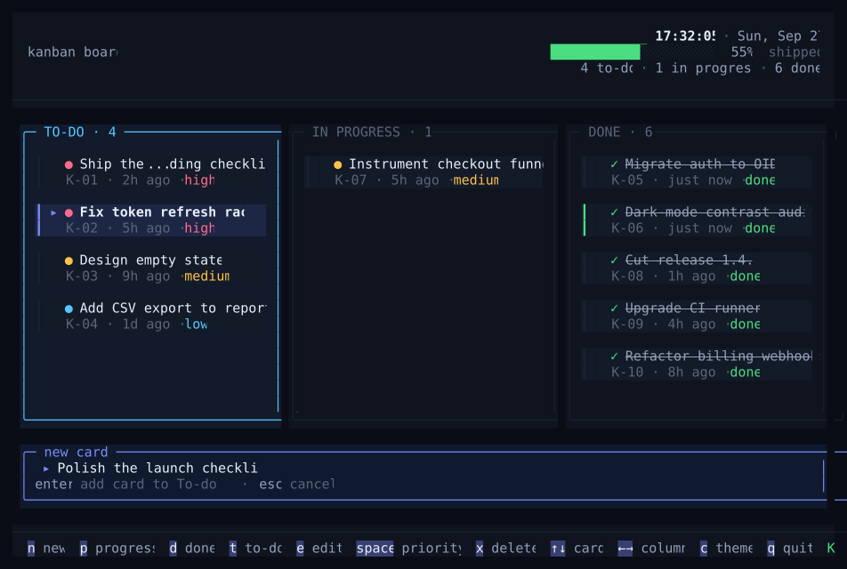

# Flow — kanban in the terminal

[](https://github.com/m0hdrar/kanban_tui/releases)
[](LICENSE)


A premium little kanban board built with [OpenTUI](https://github.com/sst/opentui)
(`@opentui/core`) on Bun. Three columns — **To-do**, **In Progress**, **Done** —
with priority markers, aging, a live progress bar and a composer for new cards.



## Installation

Install with [Homebrew](https://brew.sh):

```sh
brew install m0hdrar/tap/kanban-tui
```

Then run:

```sh
kanban-tui
```

Supports macOS on Apple Silicon and Intel.

## Data

Your board is saved after every change to:

```text
~/Library/Application Support/kanban_tui/board.json
```

If the file is corrupted, the app reports it and exits without overwriting it.

## Development

```bash
bun install
bun run start
```

## Keys

| Key | Action |
| --- | --- |
| `←` / `→` (or `h` / `l`) | switch column |
| `↑` / `↓` (or `k` / `j`) | select a card |
| `n` | new card (created in To-do) |
| `p` | move the selected card to **In Progress** |
| `d` | move the selected card to **Done** |
| `t` | move the selected card back to **To-do** |
| `x` / `del` | delete the selected card |
| `q` / `ctrl+c` | quit |

The composer takes a title, `enter` adds the card, `esc` cancels.

## Scripts

| Script | What it does |
| --- | --- |
| `bun run start` | run the board |
| `bun run dev` | run with watch mode |
| `bun run preview` | render a reproducible snapshot to `preview/` |
| `bun test` | run the tests |
| `bun run typecheck` | `tsc --noEmit` |

## Layout

```
index.ts          entry point — renderer, keys, shutdown
src/app.ts        all renderables: header, columns, cards, composer, footer
src/board.ts      card/column model + saving to board.json (framework-free)
src/theme.ts      palette
src/format.ts     clock / date / age helpers
src/widgets.ts    progress bar + keycap legend
scripts/preview.ts  headless snapshot (txt / ans / svg)
```

## Releasing

```sh
scripts/release.sh 0.2.0
```

Builds the macOS binaries, publishes a GitHub release, and updates the formula in
[m0hdrar/homebrew-tap](https://github.com/m0hdrar/homebrew-tap).

## License

[MIT](LICENSE)
