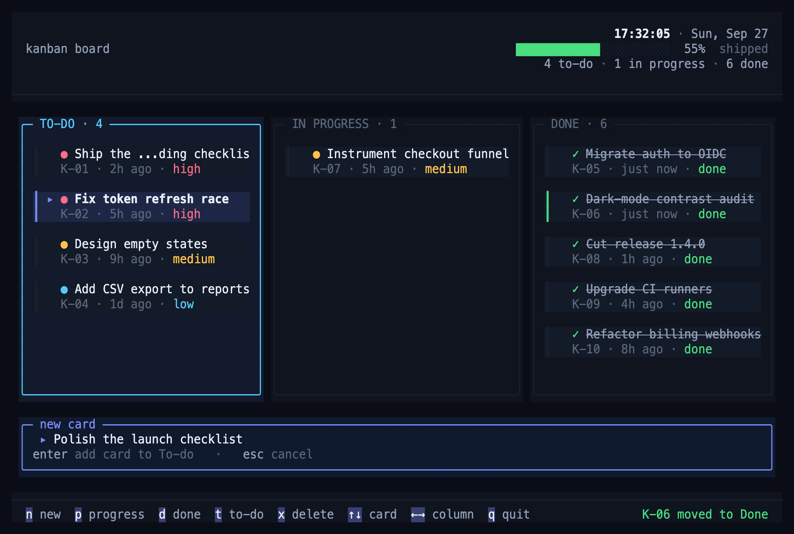

# Flow

[](https://github.com/m0hdrar/kanban_tui/releases)
[](LICENSE)


A keyboard-first kanban board for your terminal, built with [Bun](https://bun.sh) and [OpenTUI](https://github.com/sst/opentui).



## Features

- **Three columns:** To-do, In Progress and Done, moved between with a single key
- **Priorities:** each card is marked high, medium or low at a glance
- **Card age:** see how long a card has waited, been in progress, or been done
- **Progress:** a live progress bar and card counts in the header
- **Quick capture:** press `n`, type a title, press `Enter`
- **Local storage:** no account and no cloud; your board is saved on your machine after every change

## Installation

Install with [Homebrew](https://brew.sh):

```sh
brew install m0hdrar/tap/kanban-tui
```

Then run:

```sh
kanban-tui
```

Supports macOS on Apple Silicon and Intel.

### As a herdr plugin

Run Flow in a [herdr](https://herdr.dev) pane (needs [Bun](https://bun.sh)):

```sh
herdr plugin install m0hdrar/kanban_tui
```

Bind a key that jumps to the board pane (and opens one if none is open) in `~/.config/herdr/config.toml`:

```toml
[[keys.command]]
key = "prefix+t"
type = "plugin_action"
command = "m0hdrar.kanban.open"
description = "kanban"
```

### Open work in the herdr tab bar

`kanban-tui status` prints your open work as one line, such as `Kanban 2 doing · 5 to-do`, and prints nothing when To-do and In Progress are empty. To show it at the right of herdr's tab bar:

```toml
[ui]
tab_bar_right = [
  { type = "command", command = "kanban-tui status", interval_seconds = 5, timeout_seconds = 2 },
]
```

Then run `herdr server reload-config`.

## Usage

### Board

| Key | Action |
| --- | --- |
| `←` / `→` or `h` / `l` | Switch column |
| `↑` / `↓` or `k` / `j` | Select a card |
| `n` | Add a card to To-do |
| `p` | Move the selected card to In Progress |
| `d` | Move the selected card to Done |
| `t` | Move the selected card back to To-do |
| `Space` | Change the selected card's priority (medium → high → low); cards sort high to low |
| `x` / `Delete` | Delete the selected card |
| `q` / `Ctrl+C` | Quit |

### New card

| Key | Action |
| --- | --- |
| `Enter` | Add the card |
| `Esc` | Cancel |

## Data

Your board is saved after every change to one file:

```text
~/Library/Application Support/kanban_tui/board.json
```

If the file is corrupted, Flow shows an error and exits without overwriting it.

## Development

Requires [Bun](https://bun.sh) 1.3 or newer.

```sh
bun install
bun run dev          # run in watch mode
bun test             # run the tests
bun run typecheck    # check types
bun run preview      # render a snapshot of the board to preview/
```

### Project layout

```text
index.ts             entry point: renderer, keys, shutdown
src/app.ts           header, columns, cards, composer and footer
src/board.ts         card and column model, saved to board.json
src/theme.ts         colour palette
src/format.ts        clock, date and age helpers
src/widgets.ts       progress bar and key hints
scripts/preview.ts   headless snapshot (txt, ans, svg)
```

### Releasing

```sh
scripts/release.sh 0.3.0
```

This command does three things:

- Builds the macOS binaries
- Publishes a GitHub release
- Updates the formula in [m0hdrar/homebrew-tap](https://github.com/m0hdrar/homebrew-tap)

## License

[MIT](LICENSE)
